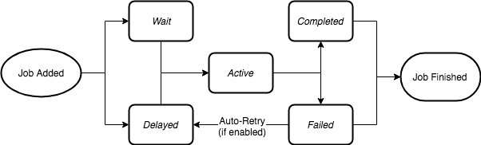

<div align="center" style="padding-bottom: 50px;">
  <br/>
  
  <br/>
</div>

# What is Bull?

Bull is a Node library that implements a fast and robust queue system based on [redis](https://redis.io).

Although it is possible to implement queues directly using Redis commands, this library provides an API that takes care of all the low-level details and enriches Redis basic functionality so that more complex use-cases can be handled easily.

If you are new to queues you may wonder why they are needed after all. Queues can solve many different problems in an elegant way, from smoothing out processing peaks to creating robust communication channels between microservices or offloading heavy work from one server to many smaller workers, etc.

# Getting Started

Bull is a public npm package and can be installed using either npm or yarn:

```bash
$ npm install bull --save
```

or

```bash
$ yarn add bull
```

In order to work with Bull, you also need to have a Redis server running. For local development you can easily install
it using [docker](https://hub.docker.com/_/redis/).

Bull will by default try to connect to a Redis server running on `localhost:6379`

# Simple Queues

A queue is simply created by instantiating a Bull instance:

```js
const myFirstQueue = new Bull('my-first-queue');
```

A queue instance can normally have 3 main different roles: A job producer, a job consumer or/and an events listener.

Although one given instance can be used for the 3 roles, normally the producer and consumer are divided into several instances. A given queue, always referred by its instantiation name ( `my-first-queue` in the example above ), can have many producers, many consumers, and many listeners. An important aspect is that producers can add jobs to a queue even if there are no consumers available at that moment: queues provide asynchronous communication, which is one of the features that makes them so powerful.

Conversely, you can have one or more workers consuming jobs from the queue, which will consume the jobs in a given order: FIFO (the default), LIFO or according to priorities.

Talking about workers, they can run in the same or different processes, in the same machine or in a cluster. Redis will act as a common point, and as long as a consumer or producer can connect to Redis, they will be able to co-operate processing the jobs.

## Producers

A job producer is simply some Node program that adds jobs to a queue, like this:

```js
const myFirstQueue = new Bull('my-first-queue');

const job = await myFirstQueue.add({
  foo: 'bar'
});
```

As you can see a job is just a javascript object. This object needs to be serializable, more concrete it should be possible to JSON stringify it, since that is how it is going to be stored in Redis.

It is also possible to provide an options object after the job's data, but we will cover that later on.

## Consumers

A consumer or worker (we will use these two terms interchangeably in this guide), is nothing more than a Node program
that defines a process function like so:

```js
const myFirstQueue = new Bull('my-first-queue');

myFirstQueue.process(async (job) => {
  return doSomething(job.data);
});
```

The `process` function will be called every time the worker is idling and there are jobs to process in the queue. Since
the consumer does not need to be online when the jobs are added it could happen that the queue has already many jobs waiting in it, so then the process will be kept busy processing jobs one by one until all of them are done.

In the example above we define the process function as `async`, which is the highly recommended way to define them.
If your Node runtime does not support async/await, then you can just return a promise at the end of the process
function for a similar result.

The value returned by your process function will be stored in the jobs object and can be accessed later on, for example
in a listener for the `completed` event.

Sometimes you need to provide job's _progress_ information to an external listener, this can be easily accomplished
by using the `progress` method on the job object:

```js
myFirstQueue.process( async (job) => {
  let progress = 0;
  for(i = 0; i < 100; i++){
    await doSomething(job.data);
    progress += 10;
    job.progress(progress);
  }
});
```

## Listeners

Finally, you can just listen to events that happen in the queue. Listeners can be local, meaning that they only will
receive notifications produced in the _given queue instance_, or global, meaning that they listen to _all_ the events
for a given queue. So you can attach a listener to any instance, even instances that are acting as consumers or producers. But note that a local event will never fire if the queue is not a consumer or producer, you will need to use global events in that
case.

```js
const myFirstQueue = new Bull('my-first-queue');

// Define a local completed event
myFirstQueue.on('completed', (job, result) => {
  console.log(`Job completed with result ${result}`);
})
```

## A Job's Lifecycle

In order to use the full potential of Bull queues, it is important to understand the lifecycle of a job.
From the moment a producer calls the `add` method on a queue instance, a job enters a lifecycle where it will
be in different states, until its completion or failure (although technically a failed job could be retried and get a new lifecycle).



When a job is added to a queue it can be in one of two states, it can either be in the "wait" status, which is, in fact, a waiting list, where all jobs must enter before they can be processed, or it can be in a "delayed" status: a delayed status implies that the job is waiting for some timeout or to be promoted for being processed, however, a delayed job will not be processed directly, instead it will be placed at the beginning of the waiting list and processed as soon as a worker is idle.

The next state for a job is the "active" state. The active state is represented by a set, and are jobs that are currently being
processed, i.e. they are running in the `process` function explained in the previous chapter. A job can be in the active state for an unlimited amount of time until the process is completed or an exception is thrown so that the job will end in
either the "completed" or the "failed" status.

## Stalled jobs

In Bull, we defined the concept of stalled jobs. A stalled job is a job that is being processed but where Bull suspects that
the process function has hanged. This happens when the process function is processing a job and is keeping the CPU so busy that
the worker is not able to tell the queue that it is still working on the job.

When a job stalls, depending on the job settings the job can be retried by another idle worker or it can just move to the failed status.

Stalled jobs can be avoided by either making sure that the process function does not keep Node event loop busy for too long (we are talking several seconds with Bull default options), or by using a separate [sandboxed processor](#sandboxed-processors).

# Events

A Queue in Bull generates a handful of events that are useful in many use cases.
Events can be local for a given queue instance (a worker), for example, if a job is completed in a given worker a local event will be emitted just for that instance. However, it is possible to listen to all events, by prefixing ```global:``` to the local event name. Then we can listen to all the events produced by all the workers of a given queue.

A local complete event:
```js
queue.on('completed', job => {
  console.log(`Job with id ${job.id} has been completed`);
})
```

Whereas the global version of the event can be listen to with:

```js
queue.on('global:completed', jobId => {
  console.log(`Job with id ${jobId} has been completed`);
})
```

Note that signatures of global events are slightly different than their local counterpart, in the example above it is only sent the job id not a complete instance of the job itself, this is done for performance reasons.

The list of available events can be found in the [reference](https://github.com/OptimalBits/bull/blob/master/REFERENCE.md#eventsk).

# Queue Options

A queue can be instantiated with some useful options, for instance, you can specify the location and password of your Redis server,
as well as some other useful settings. All these settings are described in Bull's [reference](https://github.com/OptimalBits/bull/blob/master/REFERENCE.md#queue) and we will not repeat them here, however, we will go through some use cases.

## Rate Limiter

It is possible to create queues that limit the number of jobs processed in a unit of time. The limiter is defined per queue, independently of the number of workers, so you can scale horizontally and still limiting the rate of processing easily:

```js
// Limit queue to max 1.000 jobs per 5 seconds.
const myRateLimitedQueue = new Queue('rateLimited', {
  limiter: {
    max: 1000,
    duration: 5000
  }
});
```

When a queue hits the rate limit, requested jobs will join the `delayed` queue.

## Named jobs

It is possible to give names to jobs. This does not change any of the mechanics of the queue but can be used for clearer code and
better visualization in UI tools:

```js
// Jobs producer
const myJob = await transcoderQueue.add('image', { input: 'myimagefile' });
const myJob = await transcoderQueue.add('audio', { input: 'myaudiofile' });
const myJob = await transcoderQueue.add('video', { input: 'myvideofile' });
```

```js
// Worker
transcoderQueue.process('image', processImage);
transcoderQueue.process('audio', processAudio);
transcoderQueue.process('video', processVideo);
```

Just keep in mind that every queue instance require to provide a processor for *every* named job or you will get an exception.

## Sandboxed Processors

As explained above, when defining a process function, it is also possible to provide a concurrency setting. This setting allows the worker to process several
jobs in parallel. The jobs are still processed in the same Node process,
and if the jobs are very IO intensive they will be handled just fine.

Sometimes jobs are more CPU intensive which could lock the Node event loop
for too long and Bull could decide the job has been stalled. To avoid this situation, it is possible to run the process functions in separate Node processes. In this case, the concurrency parameter will decide the maximum number of concurrent processes that are allowed to run.

We call this kind of processes for "sandboxed" processes, and they also have the property that if the crash they will not affect any other process, and a new
process will be spawned automatically to replace it.


# Job types

The default job type in Bull is "FIFO" (first in first out), meaning that the jobs are processed in the same order they are coming into the
queue. Sometimes it is useful to process jobs in a different order.

## LIFO

Lifo (last in first out) means that jobs are added to the beginning of the queue and therefore will be processed as soon as the worker is idle.

```js
const myJob = await myqueue.add({ foo: 'bar' }, { lifo: true });
```

## Delayed

It is also possible to add jobs to the queue that are delayed a certain amount of time before they will be processed. Note that the delay parameter means the _minimum_ amount of time the job will wait before being processed. When the delay time has passed the job will be moved to the beginning of the queue and be processed as soon as a worker is idle.

```js
// Delayed 5 seconds
const myJob = await myqueue.add({ foo: 'bar' }, { delay: 5000 });
```

## Prioritized

Jobs can be added to a queue with a priority value. Jobs with higher priority will be processed before than jobs with lower priority. Highest priority is 1, and lower the larger integer you use. Keep in mind that priority queues are a bit slower than a standard queue (currently insertion time O(n), n being the number of jobs currently waiting in the queue, instead of O(1) for standard queues).

```js
const myJob = await myqueue.add({ foo: 'bar' }, { priority: 3 });
```

## Repeatable

Repeatable jobs are special jobs that repeat themselves indefinitely or until a given maximum date or the number of repetitions has been reached, according to a cron specification or a time interval.

```js
// Repeat every 10 seconds for 100 times.
const myJob = await myqueue.add(
  { foo: 'bar' },
  {
    repeat: {
      every: 10000,
      limit: 100
    }
  }
);

// Repeat payment job once every day at 3:15 (am)
paymentsQueue.add(paymentsData, { repeat: { cron: '15 3 * * *' } });
```

There are some important considerations regarding repeatable jobs:

- Bull is smart enough not to add the same repeatable job if the repeat options are the same. (CAUTION: A job id is part of the repeat options since: https://github.com/OptimalBits/bull/pull/603, therefore passing job ids will allow jobs with the same cron to be inserted in the queue)
- If there are no workers running, repeatable jobs will not accumulate next time a worker is online.
- repeatable jobs can be removed using the [removeRepeatable](https://github.com/OptimalBits/bull/blob/master/REFERENCE.md#queueremoverepeatable) method.

